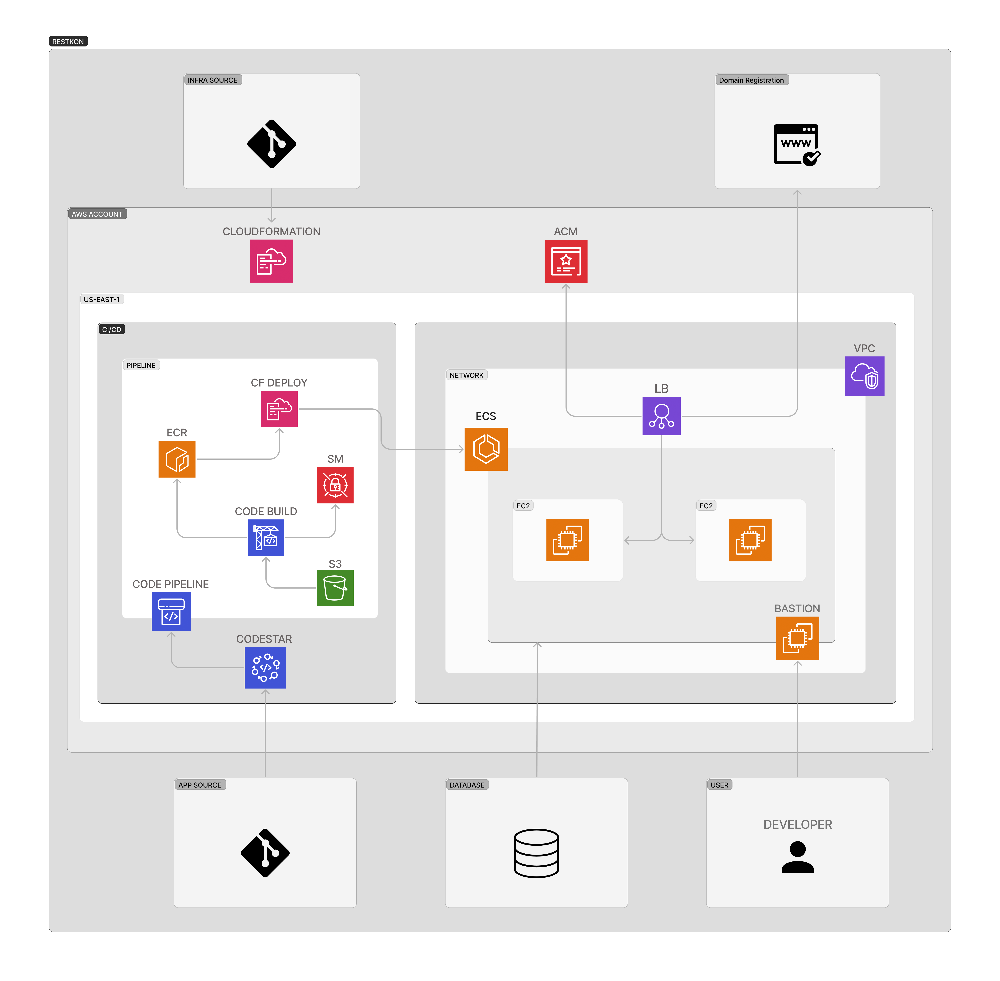

# ECS Infrastructure Deployment

This repository contains the AWS CloudFormation templates required to deploy an ECS

## Infrastructure Diagram

<p align="center" width="100%">
    
</p>

## Infrastructure Components

1. CloudFormation
2. ECS (Elastic Container Service)
3. EC2 (Elastic Compute Cloud)
4. ALB (Application Load Balancer)
5. VPC (Virtual Private Cloud)
6. SM (Secrets Manager)
7. CodeBuild
8. CloudFormation to Deploy
9. ECR (Elastic Container Registry)
10. CodePipeline
11. CodeStar Connections

## Deployment Order

1. **VPC:**

   - Deploy the VPC template first to establish the network environment.

     ```bash
     aws cloudformation deploy --template-file ./network/vpc.yaml --stack-name egydio-prod-vpc --capabilities CAPABILITY_IAM
     ```

2. **Application Load Balancer (ALB):**

   - Deploy the ALB template to enable load balancing for the egydio environment.

     ```bash
      aws cloudformation deploy --template-file ./network/alb.yaml --stack-name egydio-prod-alb --capabilities CAPABILITY_IAM
     ```

     - **2.1** After deploying the ALB, make sure to add the desired domain for the application to your domain aggregator, simply add the load balancer's default dns as the subdomain value.
       - **2.2** After adding DNS ALB to your domain aggregator, create a valid certificate in ACM and send its arn to the ALB deployment template.

3. **Elastic Container Registry (ECR):**

   - Deploy the ECR template to set up the registry for Docker images.

     ```bash
     aws cloudformation deploy --template-file ./ci-cd/ecr.yaml --stack-name egydio-prod-ecr --capabilities CAPABILITY_IAM
     ```

     - **3.1** After deploying ECR registry, ensure that a Docker image is available within the ECR repository.

4. **ECS Cluster:**

   - Deploy the ECS Cluster template to create the container orchestration platform.

     ```bash
     aws cloudformation deploy --template-file ./cluster/ecs.yaml --stack-name egydio-prod-ecs --capabilities CAPABILITY_IAM
     ```

     - **4.1:** After deploying ECS cluster, make sure to add the environment variables contained in the application to the secret manager, by default the secret path that this search infrastructure is prod/egydio/admin-svc.

5. **ECS Service:**

   - Deploy the ECS Service template to define how the egydio application runs within the cluster.

     ```bash
     aws cloudformation deploy --template-file ./cluster/ecs-service.yaml --stack-name egydio-prod-ecs-service --capabilities CAPABILITY_IAM
     ```

     - **5.1:** After deploying the pipeline, make sure to add the service manifest to the artifact s3 bucket at: /buildspec/svc-deploy.yaml.

6. **CI/CD Pipeline:**

   - Deploy the CI/CD pipeline template to automate the continuous integration and deployment processes.

     ```bash
     aws cloudformation deploy --template-file ./ci-cd/pipeline.yaml --stack-name egydio-prod-pipeline --capabilities CAPABILITY_IAM
     ```

### Automatic Deploy

```bash
./deploy.sh
```

- Before running this command, make sure you have the necessary access to the AWS account

## Notes

- Make sure to customize the parameters in each CloudFormation template according to your specific requirements.
- Ensure that you have the necessary AWS credentials and permissions to execute CloudFormation deployments.
